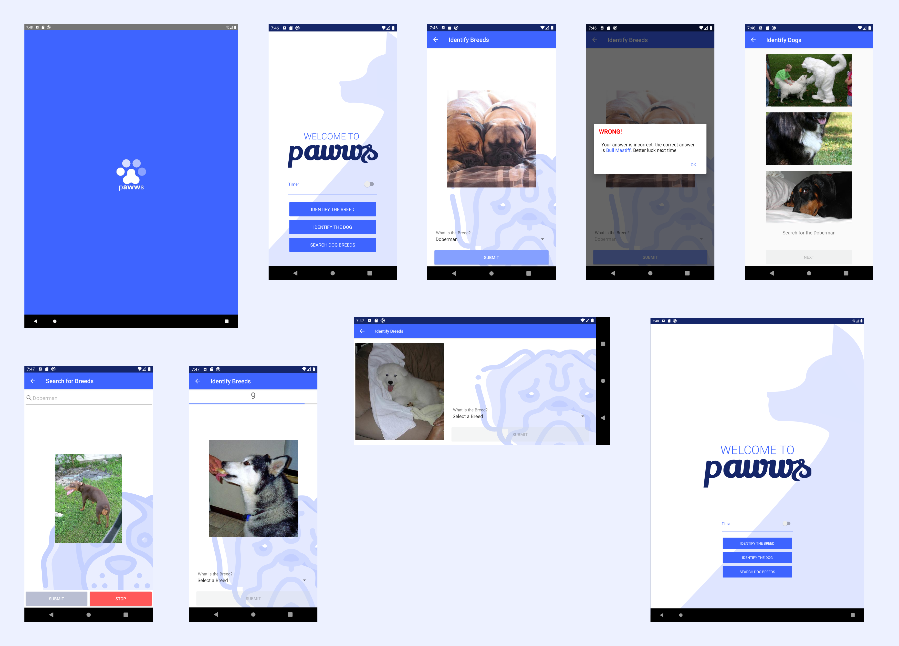

# Pawws

A Dog guessing game that intuitively improves your knowledge on dogs that was built for an assesment for the Mobile Application Development module at the Informatics Institute of Technology in collaboration with the University of Westminster.

The purpose of the assesment was to test our understanding on the Android development fundamentals in Java. The fundamentals are as follows but are not limited to,

1. View hierarchy
2. Android Architecture patterns 
3. Understanding of various layouts
4. Understanding of different views/elements
5. UI/UX

***

## Screenshots

***

## Technologies used

**Built using**

* Java 1.8
* Standford Dogs Dataset

**Built on**

* Android Studio 3.5.3

***

## Features

### 1. Identify Breeds

This game shows a randomly picked image of a dog breed and requests the user to select a breed using the spinner in the page, which has enlisted all the breeds of the dogs within the application. Only after selecting a breed can the user progress to the next screen. After selecting the breed from the spinner the user clicks on the "SUBMIT" button where the answer is checked and if it is incorrect, show the user the correct answer in an alert box. Then the user can move onto the next page where the flow is similar until the user decides to go back. 

Timer can be enables for this game to spice things up.

### 2. Identify Dogs

This game shows 3 randomly picked image of dogs and requests the user to select a dog by clicking on one image. Only after selecting a breed can the user progress to the next screen. After selecting the breed the answer is checked and if it is incorrect, show the user the correct answer in an alert box. Then the user can move onto the next page where the flow is similar until the user decides to go back. 

Timer can be enables for this game to make things a little bit more interesting.

### 3. Search Breeds

This is a page dedicated to learning more about a breed, and what they might look like. Here the user can type whatever breed they want to learn more on, and when the "SEARCH" button a slide show of all the images of that specific breed are shown. The slideshow can be stopped with the press of the "STOP" button.

***

## Installation

Clone the repo, open the project in Android Studio, hit "Run". Done!

***

## Publications

The Pawws application was published in the Google Play Store. The application can be browsed at https://play.google.com/store/apps/details?id=com.visal.mobilecoursework1

*** 

## Credits

Standford Dogs Dataset - http://vision.stanford.edu/aditya86/ImageNetDogs/
